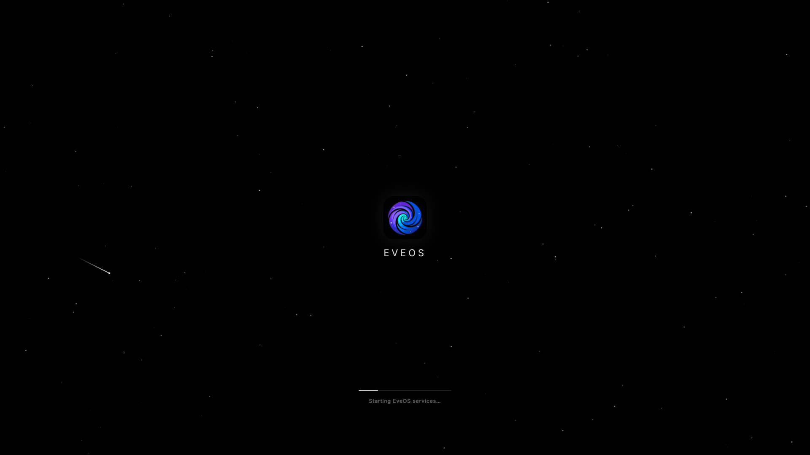
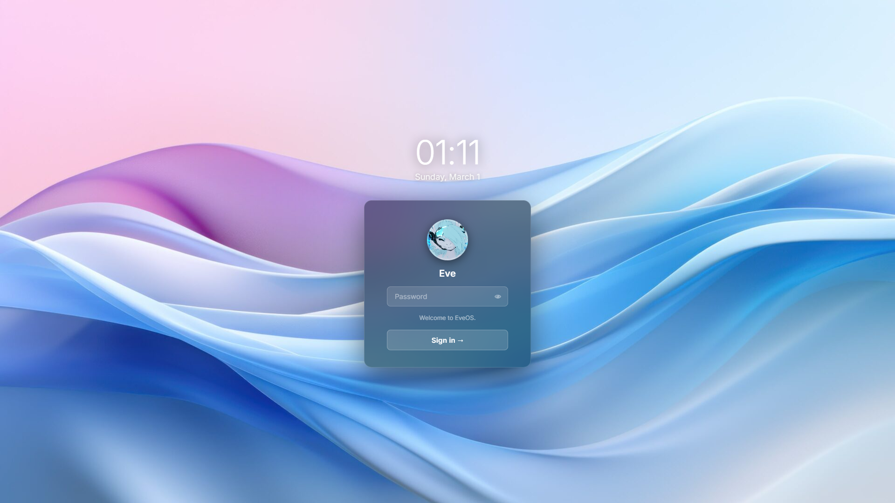
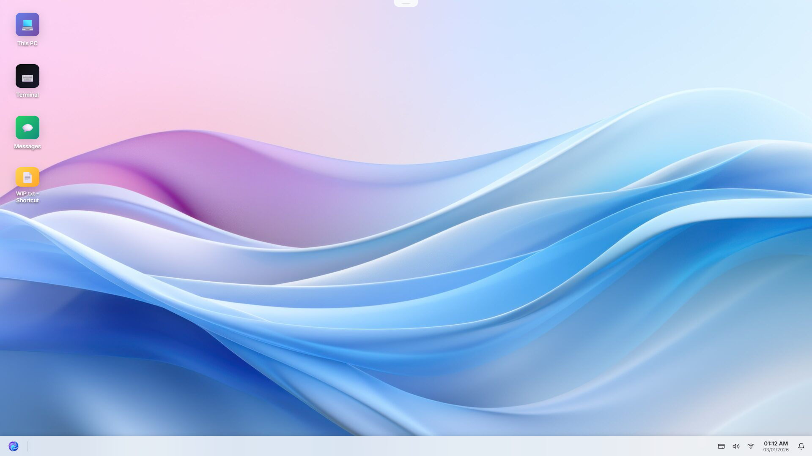
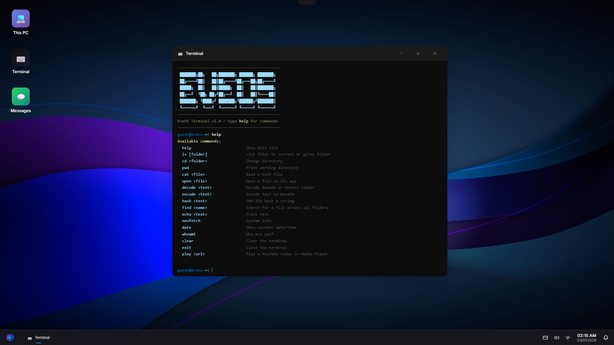

EveOS
========

A hacker simulator game built as a simulated desktop OS,
running in your browser or as a native desktop app via Electron.

Boot into EveOS, complete tasks sent through a mysterious messaging app,
use the terminal to install tools, and uncover what's really going on.

---

PREVIEW
-------

| Sign-in Screen | Desktop Screen | Terminal App |
|--------|----------|----------|
|  |  |  |

FEATURES
--------

  - Simulated desktop environment with taskbar, Start menu, and window management
  - Terminal with apt package manager — install extensions to unlock new commands
  - Messages app — receive tasks and story progression from unknown contacts
  - Marketplace — purchase apps and extensions with in-game currency
  - File Explorer with folder navigation
  - Music Player, Video Player, Photos, Text Editor, Calculator
  - Settings with personalization and system info
  - Notification system
  - Dark/Light mode with accent color support
  - Logon screen with password protection

SYSTEM REQUIREMENTS
---------

- 1280x720p / 1920x1080p monitor
- NVIDIA GT 710 / AMD equivalent
- 4-core Intel / AMD processor
- 500MB of free space
- 8GB of memory / RAM
- Windows 10 / 11 x64

DOWNLOADS
---------

- Pre-built binaries are available on the Releases page.

LICENSE
-------

EveOS is licensed under CC BY-NC-SA 4.0.
See LICENSE.md for details.

EveOS — Copyright (c) 2026 Everest